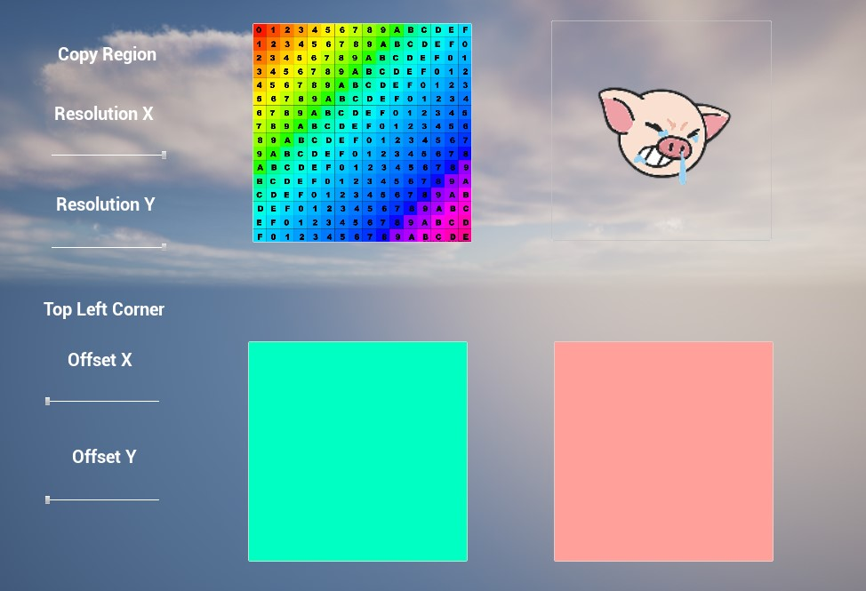

# unreal_ptest_varadise
unreal_ptest_varadise is a plug-in for copying image to clipboard in unreal engine\.

## Screenshots

### Demo
| clipboard test map |
|---|
||

## Features
- copy unreal texture / FColor data to clipboard in Windows.
- ui option for users to choose the image resolution before copying.

## Explaining the logic
- use win32 api to open the clipboard, then set pixel data to the clipboard

## Challenges
- familiar with unreal and win32 api
- familiar with bitmap format

## How to test
- open the test map and click the image to copy data to clipboard

## Dependencies
- https://github.com/nothings/stb

## References
- https://learn.microsoft.com/en-us/windows/win32/dataxchg/using-the-clipboard#copying-information-to-the-clipboard